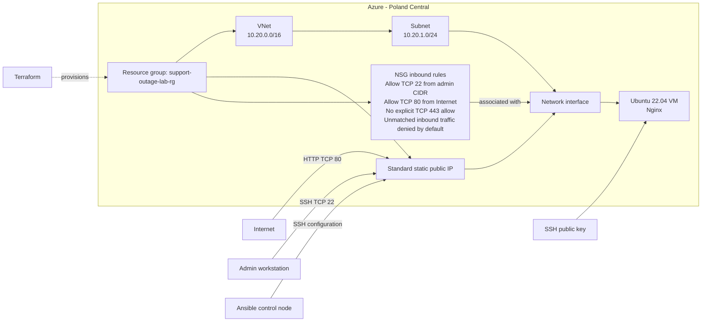

# Azure Linux Web Application Outage Investigation

A small Azure lab for practicing Linux, web-service, and network troubleshooting through controlled incidents. Terraform provisions the infrastructure; Ansible configures Nginx. The goal is to collect evidence, test hypotheses, verify recovery, and document root cause—not just apply fixes.

## Project status

- **Infrastructure:** deployed in Poland Central; Terraform state contains 10 resources.
- **VM:** Ubuntu 22.04.5 LTS, `Standard_B2als_v2`.
- **Web service:** Nginx 1.18.0, installed and configured by Ansible.
- **Ansible:** connectivity verified; a second playbook run reported `changed=0`.
- **Baseline:** Nginx is active, listens on TCP/80, and returned HTTP 200 from both the VM and the external client.
- **Not implemented yet:** DNS, HTTPS/TLS, Azure Monitor, and Log Analytics.

## Objectives

- Build a repeatable Azure Linux web environment with Terraform.
- Configure the host with Ansible and demonstrate idempotency.
- Investigate service, Linux, and network failures using observable evidence.
- Produce support-quality incident notes and root-cause analyses.

## Architecture

Terraform provisions the Azure resources. The NSG is associated with the VM's NIC. Ansible connects to the VM over SSH and configures Nginx.



The lab currently exposes HTTP on TCP/80. SSH on TCP/22 is restricted to the configured administrator CIDR. HTTPS is not configured; there is no explicit inbound allow rule for TCP/443. DNS and monitoring resources are not part of the current deployment.

## Technologies

**In use:** Azure, Terraform, AzureRM, Ubuntu Linux, Network Security Groups, public IP, SSH, Ansible, and Nginx.

**Planned:** DNS, HTTPS/TLS, Azure Monitor, and Log Analytics.

## Skills practiced

- Terraform resource dependencies, state, planning, and lifecycle operations.
- Azure network access and NSG rule interpretation.
- Linux service, process, socket, and HTTP checks.
- Ansible inventory, SSH connectivity, privilege escalation, and idempotency.
- Evidence-based troubleshooting and root-cause analysis.

## Repository layout

```text
.
├── terraform/        # Terraform configuration and local, ignored inputs/state
├── ansible/
│   ├── files/        # Static Nginx landing page
│   ├── inventory.ini # Generated local inventory; do not commit
│   ├── ansible.cfg   # Local Ansible connection settings
│   └── site.yml      # Nginx configuration playbook
└── commands/         # Baseline checks and incident notes
```

## Prerequisites

- Terraform CLI meeting the constraint in `terraform/versions.tf`.
- Azure CLI authenticated to the intended subscription.
- Ansible installed on the control machine.
- An SSH key pair available locally. The VM receives only the public key.

Create the ignored `terraform/terraform.tfvars` file with your permitted region and your current public IPv4 address in `/32` notation. Do not commit this file or include your actual address in portfolio material. Supply the public key through the environment, for example:

```bash
export ARM_SUBSCRIPTION_ID="$(az account show --query id -o tsv)"
export TF_VAR_ssh_public_key="$(cat ~/.ssh/id_azure_lab.pub)"
```

## Deploy and configure

From the repository root:

```bash
make init
make fmt
make validate
make plan
make apply
```

`make apply` applies the saved plan, so regenerate the plan after configuration changes. To destroy and rebuild the lab, use this order:

```bash
make destroy
make plan
make apply
```

After applying, regenerate the local Ansible inventory from Terraform's `ansible_inventory` output. Keep `ansible/inventory.ini` ignored because it contains the changing public IP.

From `ansible/`, verify connectivity and configure Nginx:

```bash
ansible web -m ping
ansible-playbook site.yml
ansible-playbook site.yml
```

The second real playbook run should report `changed=0`. The first run's check-mode preview may not complete successfully on a fresh VM: check mode predicts package installation without installing the service that a later task tries to manage.

## Baseline validation

The recorded pre-Nginx state had no listener on TCP/80 and an HTTP request was refused. After Ansible configured Nginx, the service was active, Nginx listened on TCP/80, and both VM-local and public HTTP checks returned `200 OK`.

Useful checks include:

```bash
hostnamectl
uname -r
systemctl is-system-running
systemctl status nginx --no-pager
sudo ss -lntp
nginx -v
curl -I --max-time 5 http://localhost
```

Run VM-local checks on the VM. Run the public HTTP check from the control machine using the current Terraform output, and redact the address from saved evidence. Do not confuse `curl localhost` on the control machine with a request to the VM.

See [`commands/day1-baseline-validation.md`](commands/day1-baseline-validation.md) for the baseline record and evidence checklist.

## Future incidents

These are planned scenarios; they are not all implemented yet.

| Incident                  | Controlled fault                                                         | Investigation focus                                                             |
| ------------------------- | ------------------------------------------------------------------------ | ------------------------------------------------------------------------------- |
| 001 - Nginx stopped       | Stop the Nginx service                                                   | Service state, listening sockets, local versus public HTTP result, service logs |
| 002 - HTTP blocked by NSG | Remove or alter the TCP/80 allow path                                    | Effective NSG rules, connection timeout/refusal, Azure network evidence         |
| Linux permissions         | Change a controlled web-root or file permission                          | Ownership, mode, Nginx error logs, HTTP behavior                                |
| DNS resolution            | Add DNS, then introduce a controlled record/resolver error               | `dig`/`getent`, name versus direct-IP behavior                                  |
| HTTPS/TLS                 | Add HTTPS, then test a controlled certificate or TLS configuration issue | Certificate validity, TLS handshake, Nginx logs                                 |
| Resource pressure         | Apply a bounded CPU, memory, or disk exercise                            | System metrics, service impact, logs, recovery                                  |
| Monitoring investigation  | Add Azure Monitor and Log Analytics                                      | Guest evidence compared with Azure telemetry                                    |

## Incident investigation workflow

For each incident, record:

1. Expected behavior and actual behavior.
2. Scope and affected path or users.
3. Evidence and commands used.
4. Hypothesis and test result.
5. Confirmed root cause, or explicitly state what remains unknown.
6. Resolution, verification, and prevention recommendations.

## Operational notes

- The resource group was imported into Terraform state after it was found in Azure without a corresponding state entry. The earlier run's output is unavailable, so the reason it was not recorded is undetermined.
- Azure-created resources outside this Terraform configuration, such as a separate Network Watcher resource group, are not removed by this lab's `make destroy` target.
- Never commit SSH private keys, `terraform.tfvars`, Terraform state, saved plan files, or the generated Ansible inventory.
